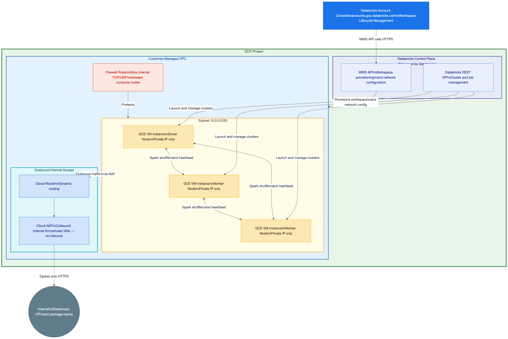
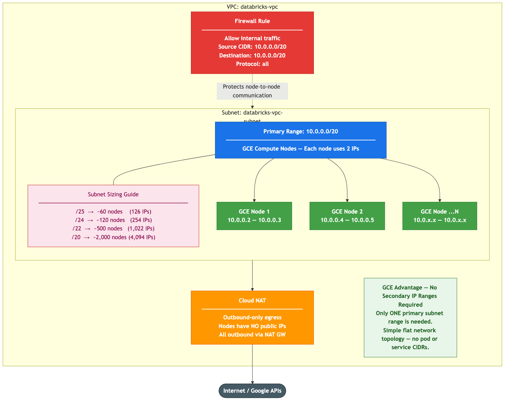
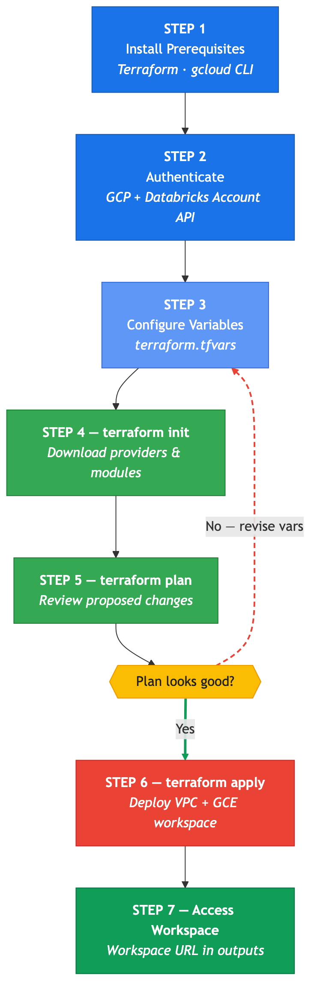

<p align="center">
  
</p>

<h1 align="center">Databricks Workspace on GCP<br/>Customer-Managed VPC</h1>

<p align="center">
  <strong>Terraform configuration to deploy a Databricks workspace on Google Cloud Platform using a customer-managed VPC with GCE-based compute, giving you full control over network topology, IP ranges, and security boundaries.</strong>
</p>

<p align="center">
  <a href="#architecture">Architecture</a> •
  <a href="#whats-included">What's Included</a> •
  <a href="#prerequisites">Prerequisites</a> •
  <a href="#step-by-step-deployment">Step-by-Step</a> •
  <a href="#variables">Variables</a> •
  <a href="#customization">Customization</a>
</p>

---

## Architecture

<p align="center">
  
</p>

Databricks on GCP uses **Google Compute Engine (GCE)** VMs for its compute plane. This deployment creates a **customer-managed VPC** in your GCP project and provisions a Databricks workspace that runs all compute nodes as GCE VM instances within your VPC — with **no public IPs**.

> **Note:** Databricks previously used GKE (Google Kubernetes Engine) for its GCP compute plane. As of 2024, all new workspaces use **GCE-based compute**, which offers simpler networking (no secondary IP ranges for pods/services) and faster cluster startup times.

## What's Included

| Resource | Description |
|---|---|
| **VPC** | Custom-mode VPC with no auto-created subnets |
| **Subnet** | Regional subnet with a single primary IP range for GCE compute nodes |
| **Firewall** | Allows all internal traffic between compute nodes |
| **Cloud Router + NAT** | Outbound internet access for private GCE VMs |
| **Databricks Network** | MWS network configuration pointing to the customer VPC |
| **Databricks Workspace** | Workspace provisioned with GCE-based compute in your VPC |

### Network Layout

<p align="center">
  
</p>

With GCE-based compute, the networking is straightforward — you only need **one primary subnet range**. Each Databricks compute node uses **2 IP addresses** from the subnet.

| Subnet CIDR | Usable IPs | Max Concurrent Nodes |
|---|---|---|
| `/25` | 126 | ~60 |
| `/24` | 254 | ~120 |
| `/23` | 510 | ~250 |
| `/22` | 1,022 | ~500 |
| `/21` | 2,046 | ~1,000 |
| `/20` | 4,094 | ~2,000 |

> **Tip:** The default `/20` supports up to ~2,000 concurrent compute nodes. For smaller workloads, a `/24` or `/23` may be sufficient.

---

## Prerequisites

Before starting, make sure you have:

- A **GCP project** with billing enabled
- A **Databricks account** on GCP with **account-level admin** access
- Your **Databricks Account ID** (found in the [account console](https://accounts.gcp.databricks.com))

---

## Deployment Workflow

<p align="center">
  
</p>

---

## Step-by-Step Deployment

### Step 1 — Install Terraform

<details>
<summary><strong>macOS</strong></summary>

#### Option A: Using Homebrew (recommended)

```bash
# Install Homebrew if you don't have it
/bin/bash -c "$(curl -fsSL https://raw.githubusercontent.com/Homebrew/install/HEAD/install.sh)"

# Install Terraform
brew tap hashicorp/tap
brew install hashicorp/tap/terraform

# Verify installation
terraform -version
```

#### Option B: Manual download

```bash
# Download the binary (Apple Silicon)
curl -LO https://releases.hashicorp.com/terraform/1.9.8/terraform_1.9.8_darwin_arm64.zip

# For Intel Macs, use:
# curl -LO https://releases.hashicorp.com/terraform/1.9.8/terraform_1.9.8_darwin_amd64.zip

# Unzip and move to PATH
unzip terraform_*.zip
sudo mv terraform /usr/local/bin/
rm terraform_*.zip

# Verify
terraform -version
```

</details>

<details>
<summary><strong>Windows</strong></summary>

#### Option A: Using Chocolatey (recommended)

```powershell
# Open PowerShell as Administrator

# Install Chocolatey if you don't have it
Set-ExecutionPolicy Bypass -Scope Process -Force
[System.Net.ServicePointManager]::SecurityProtocol = [System.Net.ServicePointManager]::SecurityProtocol -bor 3072
iex ((New-Object System.Net.WebClient).DownloadString('https://community.chocolatey.org/install.ps1'))

# Install Terraform
choco install terraform -y

# Restart your terminal, then verify
terraform -version
```

#### Option B: Using winget

```powershell
winget install Hashicorp.Terraform

# Restart your terminal, then verify
terraform -version
```

#### Option C: Manual download

1. Download from [terraform.io/downloads](https://developer.hashicorp.com/terraform/downloads)
2. Extract the `terraform.exe` file
3. Move it to a directory in your `PATH` (e.g., `C:\terraform\`)
4. Add that directory to your system PATH:
   ```powershell
   # PowerShell (run as Administrator)
   [Environment]::SetEnvironmentVariable("Path", $env:Path + ";C:\terraform", "Machine")
   ```
5. Restart your terminal and verify: `terraform -version`

</details>

---

### Step 2 — Install Google Cloud SDK (`gcloud`)

<details>
<summary><strong>macOS</strong></summary>

#### Using Homebrew

```bash
brew install --cask google-cloud-sdk

# Initialize gcloud
gcloud init
```

#### Manual install

```bash
# Download and run the installer
curl https://sdk.cloud.google.com | bash

# Restart your shell
exec -l $SHELL

# Initialize
gcloud init
```

</details>

<details>
<summary><strong>Windows</strong></summary>

#### Using the installer (recommended)

1. Download the installer from [cloud.google.com/sdk/docs/install](https://cloud.google.com/sdk/docs/install#windows)
2. Run `GoogleCloudSDKInstaller.exe`
3. Follow the prompts (keep defaults)
4. The installer will open a terminal — run `gcloud init` when prompted

#### Using PowerShell

```powershell
# Download and run
(New-Object Net.WebClient).DownloadFile("https://dl.google.com/dl/cloudsdk/channels/rapid/GoogleCloudSDKInstaller.exe", "$env:Temp\GoogleCloudSDKInstaller.exe")
& $env:Temp\GoogleCloudSDKInstaller.exe
```

</details>

---

### Step 3 — Enable Required GCP APIs

Run these commands to enable the APIs Databricks needs in your GCP project:

<details>
<summary><strong>macOS / Windows (same commands)</strong></summary>

```bash
# Set your project
gcloud config set project YOUR_PROJECT_ID

# Enable required APIs
gcloud services enable compute.googleapis.com
gcloud services enable container.googleapis.com
gcloud services enable cloudresourcemanager.googleapis.com
gcloud services enable iam.googleapis.com
```

</details>

---

### Step 4 — Authenticate

You need two sets of credentials: **GCP** and **Databricks Account API**.

<details>
<summary><strong>macOS</strong></summary>

```bash
# 1. Authenticate with GCP (opens browser)
gcloud auth application-default login

# 2. Set Databricks account-level credentials
export DATABRICKS_HOST="https://accounts.gcp.databricks.com"
export DATABRICKS_TOKEN="dapi_your_account_level_token_here"
```

> **Tip:** Add the `export` lines to your `~/.zshrc` or `~/.bashrc` to persist them across sessions.

</details>

<details>
<summary><strong>Windows</strong></summary>

```powershell
# 1. Authenticate with GCP (opens browser)
gcloud auth application-default login

# 2. Set Databricks account-level credentials
$env:DATABRICKS_HOST = "https://accounts.gcp.databricks.com"
$env:DATABRICKS_TOKEN = "dapi_your_account_level_token_here"
```

> **Tip:** To persist environment variables across sessions:
> ```powershell
> [Environment]::SetEnvironmentVariable("DATABRICKS_HOST", "https://accounts.gcp.databricks.com", "User")
> [Environment]::SetEnvironmentVariable("DATABRICKS_TOKEN", "dapi_your_token", "User")
> ```

</details>

#### How to get your Databricks Account Token

1. Go to [accounts.gcp.databricks.com](https://accounts.gcp.databricks.com)
2. Log in with your account admin credentials
3. Click on your **user icon** (top-right) > **User Settings**
4. Go to **Access tokens** > **Generate new token**
5. Give it a description and copy the token

---

### Step 5 — Clone This Repository

<details>
<summary><strong>macOS</strong></summary>

```bash
git clone https://github.com/juliandrof/terraform-databricks-gcp-cmvpc.git
cd terraform-databricks-gcp-cmvpc
```

</details>

<details>
<summary><strong>Windows</strong></summary>

```powershell
git clone https://github.com/juliandrof/terraform-databricks-gcp-cmvpc.git
cd terraform-databricks-gcp-cmvpc
```

> **Don't have Git?** Install it: `winget install Git.Git` or download from [git-scm.com](https://git-scm.com/download/win)

</details>

---

### Step 6 — Configure Variables

```bash
# Copy the example file
cp terraform.tfvars.example terraform.tfvars
```

On Windows (PowerShell):
```powershell
Copy-Item terraform.tfvars.example terraform.tfvars
```

Edit `terraform.tfvars` with your values:

```hcl
databricks_account_id = "xxxxxxxx-xxxx-xxxx-xxxx-xxxxxxxxxxxx"  # From account console
gcp_project_id        = "my-gcp-project"                        # Your GCP project ID
gcp_region            = "us-central1"                            # Desired region
workspace_name        = "my-databricks-workspace"                # Name for the workspace
vpc_name              = "databricks-vpc"                         # Name for the VPC

# Each GCE compute node uses 2 IPs — /20 supports ~2,000 concurrent nodes
subnet_ip_cidr_range = "10.0.0.0/20"
```

---

### Step 7 — Initialize Terraform

This downloads the required providers (Databricks + Google).

```bash
terraform init
```

Expected output:
```
Initializing the backend...
Initializing provider plugins...
- Installing databricks/databricks...
- Installing hashicorp/google...

Terraform has been successfully initialized!
```

---

### Step 8 — Review the Plan

```bash
terraform plan
```

This shows you **exactly** what Terraform will create. Review the output carefully:

```
Plan: 6 to add, 0 to change, 0 to destroy.
```

You should see these resources:
- `google_compute_network.databricks_vpc`
- `google_compute_subnetwork.databricks_subnet`
- `google_compute_firewall.databricks_internal`
- `google_compute_router.databricks_router`
- `google_compute_router_nat.databricks_nat`
- `databricks_mws_networks.this`
- `databricks_mws_workspaces.this`

> If something doesn't look right, go back to Step 6 and adjust your `terraform.tfvars`.

---

### Step 9 — Deploy

```bash
terraform apply
```

Type `yes` when prompted to confirm.

> **This takes 5-15 minutes.** Terraform creates the VPC and networking resources first, then provisions the Databricks workspace which sets up the GCE-based compute plane in your VPC.

Expected final output:
```
Apply complete! Resources: 7 added, 0 changed, 0 destroyed.

Outputs:

workspace_url = "https://xxxxxxxxxxxx.gcp.databricks.com"
workspace_id  = "1234567890123456"
network_id    = "xxxxxxxx-xxxx-xxxx-xxxx-xxxxxxxxxxxx"
vpc_id        = "projects/my-project/global/networks/databricks-vpc"
subnet_id     = "projects/my-project/regions/us-central1/subnetworks/databricks-vpc-subnet"
```

---

### Step 10 — Access Your Workspace

Open the `workspace_url` from the outputs in your browser. You can also retrieve it anytime:

```bash
terraform output workspace_url
```

---

## Variables

| Name | Description | Type | Default | Required |
|---|---|---|---|---|
| `databricks_account_id` | Databricks account ID | `string` | — | Yes |
| `gcp_project_id` | GCP project ID | `string` | — | Yes |
| `gcp_region` | GCP region | `string` | `us-central1` | No |
| `workspace_name` | Workspace name | `string` | `databricks-workspace` | No |
| `vpc_name` | VPC name | `string` | `databricks-vpc` | No |
| `subnet_ip_cidr_range` | Compute subnet CIDR (2 IPs per node) | `string` | `10.0.0.0/20` | No |

## Outputs

| Name | Description |
|---|---|
| `workspace_url` | Databricks workspace URL |
| `workspace_id` | Databricks workspace ID |
| `network_id` | Databricks network configuration ID |
| `vpc_id` | GCP VPC self-link |
| `subnet_id` | GCP subnet self-link |

---

## Customization

### CIDR Ranges

Adjust the subnet CIDR in `terraform.tfvars` to fit your existing network topology. With GCE compute, you only need **one subnet range** — no secondary ranges for pods or services.

Ensure there are **no overlaps** with other VPCs if you plan to use VPC peering.

### Available GCP Regions

Some common regions for Databricks on GCP:

| Region | Location |
|---|---|
| `us-central1` | Iowa, USA |
| `us-east4` | Virginia, USA |
| `us-west1` | Oregon, USA |
| `europe-west1` | Belgium |
| `europe-west3` | Frankfurt |
| `asia-southeast1` | Singapore |
| `southamerica-east1` | Sao Paulo, Brazil |

### Private Service Connect (PSC)

For fully private connectivity (no public internet path to the Databricks control plane), you can configure Private Service Connect. This requires additional Terraform resources — see the [Databricks PSC documentation](https://docs.gcp.databricks.com/en/security/network/classic/private-service-connect.html).

---

## Troubleshooting

| Problem | Solution |
|---|---|
| `Error: Permission denied` on GCP | Run `gcloud auth application-default login` and ensure your account has **Owner** or **Editor** role on the project |
| `Error: Account API unauthorized` | Verify `DATABRICKS_HOST` and `DATABRICKS_TOKEN` are set correctly. Token must be **account-level**, not workspace-level |
| `Error: CIDR range conflict` | Change the subnet CIDR in `terraform.tfvars` to avoid overlaps with existing subnets in your project |
| `Error: API not enabled` | Run the `gcloud services enable` commands from Step 3 |
| `terraform init` fails | Check your internet connection. If behind a proxy, set `HTTP_PROXY` and `HTTPS_PROXY` environment variables |
| Workspace stuck provisioning | This can take up to 15 minutes. If it exceeds 30 minutes, check the Databricks account console for errors |

---

## Clean Up

To destroy all resources created by this Terraform:

```bash
terraform destroy
```

Type `yes` when prompted. This will remove the workspace, network config, VPC, and all associated resources.

> **Warning:** This will permanently delete the Databricks workspace and all data within it.

---

## File Structure

```
terraform-databricks-gcp-cmvpc/
├── images/
│   ├── architecture.png    # Architecture diagram
│   ├── network.png         # Network/CIDR diagram
│   └── workflow.png        # Deployment workflow diagram
├── network.tf              # VPC, subnet, firewall, Cloud Router, NAT
├── workspace.tf            # Databricks network config + workspace
├── providers.tf            # Provider configuration
├── variables.tf            # Input variables
├── outputs.tf              # Output values
├── versions.tf             # Terraform and provider versions
├── terraform.tfvars.example # Example variable values
├── .gitignore              # Ignores .terraform, state files, secrets
└── README.md               # This file
```

---

## License

MIT
